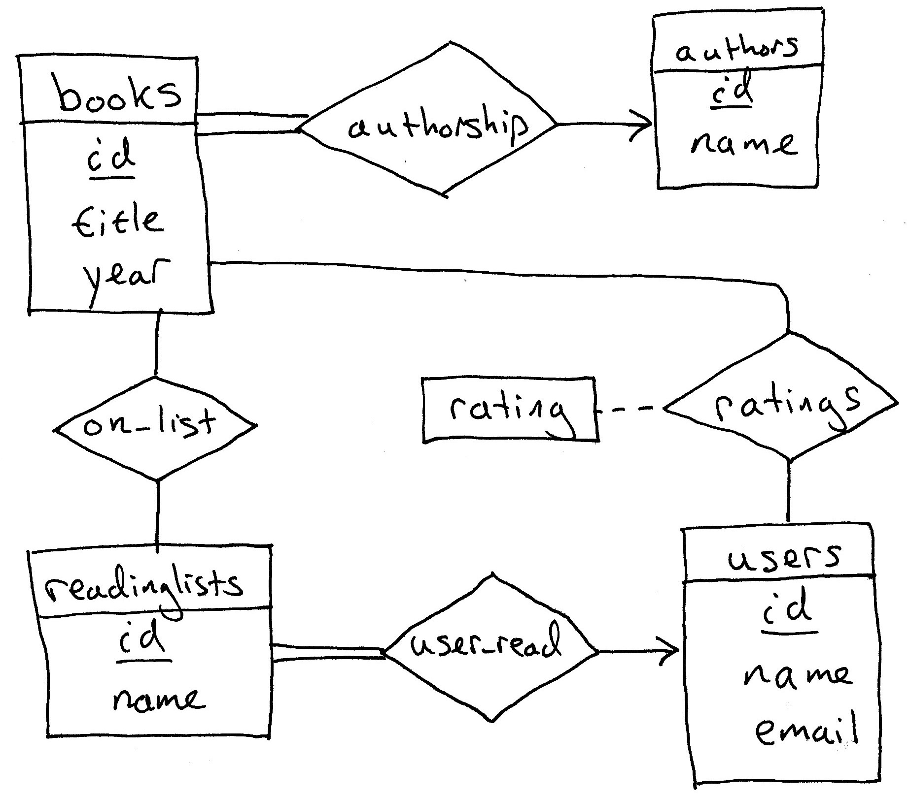
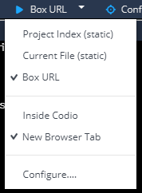

# GoodBooks

Author: Mark Smucker  
Date: July 2021 (updated from 2020 to be correct for Rails 6.1, Ruby 3, and Postgresql 13 as well as other improvements)

## Introduction

In MSCI 245, we started off with learning about relational databases.  We learned about the ideas of relations and how to interact with RDBMs using SQL.  We then progressed to learning about database design with entity-relationship diagrams and normalization.

Rails has extensive support for working with relational databases.  Rails and other web frameworks tend to be object oriented, but our databases are not.  The databases are relational.  Thus, there is a mismatch between the way Rails wants to work with data and the way the database wants to work with data.

Traditional database applications would use an API such as ODBC or JDBC to connect to the database, run queries, and get back the results of queries.  You used a similar API with the [Sequel gem](http://sequel.jeremyevans.net/) for Ruby.  Wanting to make the programmers' lives better, Rails and other web frameworks tend to use an [Object Relational Mapping (ORM)](https://en.wikipedia.org/wiki/Object-relational_mapping).  These mappings are a compromise to connect two different ways of managing data.  

To build web apps, you need to learn the ORM of Rails, which largely means learning about:

1. How to create and manage your database schema using migrations.  

1. How to create models that map to the database.

### Reference Materials

This homework is not a replacement for written documentation and tutorials.  Besides the course textbook, you will find the following helpful.  When viewing online documentation, pay attention to the version of the documentation.  What works in one version of Rails may not work in your version.  MSCI 245 and 342 currently use Rails 6.

1. Guide: [Active Record Basics](https://guides.rubyonrails.org/active_record_basics.html)

1. Guide: [Active Record Query Interface](https://guides.rubyonrails.org/active_record_querying.html)

1. Guide: [Active Record Migrations](https://guides.rubyonrails.org/active_record_migrations.html), References: [Schema Definitions](https://api.rubyonrails.org/classes/ActiveRecord/ConnectionAdapters/SchemaStatements.html) and  [table-definition (inside the do block of create_table)](https://api.rubyonrails.org/classes/ActiveRecord/ConnectionAdapters/TableDefinition.html)

1. Guide: [Active Record Associations](https://guides.rubyonrails.org/association_basics.html), Reference: [ActiveRecord::Associations::ClassMethods](https://api.rubyonrails.org/classes/ActiveRecord/Associations/ClassMethods.html)

1. Guide: [Active Record Validations](https://guides.rubyonrails.org/active_record_validations.html), Reference: [Validations, Helper Methods](https://api.rubyonrails.org/classes/ActiveModel/Validations/HelperMethods.html).


You are also likely to find helpful the full books about Rails that you can read in the O'Reilly site that all UW students have access to (follow instructions in Learn that we gave for Head First SQL):

1. [Learning Rails 5](https://ocul-wtl.primo.exlibrisgroup.com/permalink/01OCUL_WTL/5ob3ju/alma999986583426005162)

1. [Ruby on Rails Tutorial, 6th Ed](https://ocul-wtl.primo.exlibrisgroup.com/permalink/01OCUL_WTL/1jjglgg/alma999986595715005162)

1. [The Rails 5 Way, Fourth Ed.](https://ocul-wtl.primo.exlibrisgroup.com/permalink/01OCUL_WTL/5ob3ju/alma999986579602405162)

1. [Agile Web Development with Rails 6](https://ocul-wtl.primo.exlibrisgroup.com/permalink/01OCUL_WTL/5ob3ju/alma999986618645205162)


## Models and Migrations

**First things first: Your models are the most important thing in your web app.**  All of your "business logic" or what we call the brains of our apps should live in the objects that we call models.  The controller should only be a traffic cop, i.e. directing requests from the user to the models and collecting the output to hand to the views for display.  The views should have as little logic in them as possible and should largely just be about ouputting the data handed to them from the controller, which is coming from the models.  

Let's use a restaurant analogy: If the database holds our ingredients (data), the models are the chefs in the kitchen making all the food.  The executive chef acts like the controller.  The executive chef takes the order from the waitperson and directs the chefs to produce a table's dishes such that they are all ready at the same time.  The waitstaff are sort of like the views: they take orders (HTML forms and links) and deliver the food to the table.  The waitstaff is responsible for delivering the order to the kitchen, but the waitstaff shouldn't be touching the food on delivery except to put the right plates on the table.  Likewise, the executive chef (controller) delegates all the cooking to the kitchen staff.

So, the next time you are writing a view, remember: you shouldn't be cooking any food; your job is to deliver the meals nice and neatly.  Your models should have done the work for you.  Likewise, when you are writing the controller, your job is just to get the models to make the right dishes for you to give to the views.  The controller gets the models to prepare the result and then renders a view or redirects to another url.

**Summary:** Push implementation down into your models.  You can always write more model code.  Not all models are connected to a database table.  You might have models that compute the shortest path for a delivery truck, but this computation is not tied to a database table itself (it will likely read data from another model that does represent data in the database).  If you stuff business logic into views and controllers, you defeat the advantages of the MVC pattern.

### Migrations

When we were working with SQL, we would write SQL DDL to create tables, add foreign key constraints, etc.  We could do that with Rails, too, but it is far better to adopt Rails' tools for creating and maintain our database so that we create it in a way that meshes well with ActiveRecord models.  

The concept of migrations is simple: write a script to change your database schema such that we can rollback the schema changes if needed.  By putting all of our schema changes into these scripts, we can create exactly the same database on each developer's machine, and we can make sure our production server is the same, too.  (Every developer uses their own database.  We do this to avoid messing up each other's debugging.  We absolutely never develop using the production database, which is running the web app live for customers.  In 245/342, our production server is running in the cloud at Heroku.)

We use rails to generate a migration for us that we can then edit as needed.  Each migration is given a timestamp as part of its file name.  When we run migrations via `rails db:migrate`, the migrations are run in order of their timestamps.  Rails also know which migrations have been run and which haven't.  Rails will only run new migrations that have not yet been run.  If we don't like a migration, we can undo it with `rails db:rollback`. 

Rails can generate migrations as part of generating a model, as well as generate migrations on their own, i.e. no model creation.

When we are creating the database, we need to think about the order in which to create the tables.  For example, if a table has a foreign key, we cannot make that table until we've made the foreign table.  

#### Migrations and Production and "Starting Over"

Once we've deployed our system to production (Heroku), and a customer has started using the system, the production database will have real customer data in it.  We cannot simply rollback migrations on the production server, nor can we simply delete the database and start over.  

In production, if we want to change an existing and in-use database, we write additional migrations to modify the database in a manner to not lose data.  The [course texbook](http://www.saasbook.info/) describes how this is done in Section 12.4, "Releases and Feature Flags".  

In MSCI 245, if you want to "start over" with your deployed Heroku app, the easiest solution is to delete the app and create it anew.

In our development environment on Codio, when the database is messed up and you want to "start over", the best course of action is to do the following if you cannot rollback your migrations to solve the problem:

1. `rails db:drop`
1. `rails db:create`
1. `rails db:migrate`
1. `rails db:seed`


### Example - GoodBooks

To illustrate models and migrations, we'll work with the following example app, which we call GoodBooks.  The GoodBooks app allows users to create reading lists of books and to rate books.  Each book has a single author, which keeps thing simple for now.  There are many other details to the app, but they don't concern us, for we've already create the ERD and schema.

#### ERD for GoodBooks



#### Schema for GoodBooks

books ( id (PK), title, year, author_id (FK) )  
authors ( id (PK), name )  
users ( id (PK), name, email )  
readinglists ( id (PK), name, user_id (FK) )  
ratings ( user_id (PK, FK), book_id (PK, FK), rating )  
books_readinglists ( book_id (PK, FK), readinglist_id (PK, FK) )

While the ERD documents the relationships between the entities, here they are explained in more detail:

+ authors have a one to many relationship with books, and books have a one to one relationship with authors.  In other words:  
  + each book has one author (total participation, all books must always have an author)  
  + each author has zero or more books  (we can add and keep authors without a book entry)
+ users have a one to many relationship with readinglists, and readinglists have a one to one relationship with users.  In other words:  
  + each user has zero or more readinglists
  + each readinglist has one user (total participation, all readinglists must always have a user)
+ users and books have a many-to-many relationship through the ratings table.  This table stores user ratings for books.  Both users and books can have zero ratings.
+ readinglists and books have a many-to-many relationship, which we represent with the books_readinglists table.  
  + A readinglist can have zero or more books on it.
  + A book can be on zero or more readinglists.

Some notes about tables in Rails:
1. We name our entities using the plural rather than singular.  The model that is associated with an entity set, is the singular form of the plural used for the table.  Thus, we will have a books entity set (table) in the database, and a Book model.  Each Book object will represent one row in the books table.

1. Rails wants the primary key to be named `id` for entity sets.  The norm is for this to be an autoincrementing column.  Give up all hope of using composite primary keys.  (There is a gem, `composite_primary_keys`, to support using composite primary keys, but I advise against its use.)  

1. When we have foreign keys, Rails will name them with the singular of the foreign table name with an `_id` suffix.

1. Relationship sets, that we represent with a separate table, are also known as join tables in Rails, and are typically named by joining the two table names with an underscore and ordering them alphabetically.  For example, books_readinglists.  We don't have to do that, for example, ratings.

#### Getting Rails up and running

You are reading these directions having cloned the repository to a directory named `goodbooks`.  First:

```
cd goodbooks
```

and then do:

```
rails new . --database=postgresql --skip-javascript --skip-turbolinks --skip-action-mailer --skip-action-mailbox --skip-action-text --skip-active-storage --skip-action-cable --skip-spring --skip-bundle 
```

to create your rails install.  Then:

Then, open up the `Gemfile` and comment out the `jbuilder` and `tzinfo-data` gems.  (If you need more detailed instructions, see the BasicBooks instructions.)

Then, in the terminal, at the command prompt:

```
 bundle install
```

Next, add the following to `config/environments/development.rb` after "`Rails.application.configure do`":

```ruby
config.hosts << /[a-z0-9]+\-[a-z0-9]+\-3000\.codio\.io/
```

In `test/test_helper.rb` comment out:

```ruby
# parallelize(workers: :number_of_processors)

# fixtures :all
```

In `test/application_system_test_case.rb`, comment out: 

```ruby
driven_by :selenium, using: :chrome, screen_size: [1400, 1400]
```
and add:

```ruby
driven_by :rack_test
```

So, you'll end up with:

```ruby
#driven_by :selenium, using: :chrome, screen_size: [1400, 1400]
driven_by :rack_test
```

Then create a file, in the root directory of your repo, named `Procfile` and put this command in the file as per the [heroku instructions](https://devcenter.heroku.com/articles/deploying-rails-applications-with-the-puma-web-server):
```
web: bundle exec puma -C config/puma.rb
```

To create your databases do:

```
rails db:create db:migrate
```

Then check that your install works:

```
rails server -b 0.0.0.0
```
and click on "Box URL" in a "New Browser Tab".  This is what the dropdown should look like in Codio: 



You should see a message that says "Yay! You're on Rails!".  

Once you get your install working, it is time to commit all of this code to the repository:
```
git add --all
git commit -m"Yay! I am on Rails!"
git push
```

### Our first table and model

Since `authors` does not have any foreign keys, we can make it before the others.   

We will want to create an `Author` model, and its corresponding table `authors` with a migration.  When creating the model/table, we should decide at least on the data types for each attribute.  We're effectively going to be calling the [add_column](https://api.rubyonrails.org/classes/ActiveRecord/ConnectionAdapters/SchemaStatements.html#method-i-add_column) method, and the documentation for it show all of the available data type we can specify.  

For `authors`, we only have the `name` attribute, and the `:string` data type is appropriate.  The various books referenced above go into detail about how each datatype is mapped to specific datatypes in each different database. 

We will generate the model `Author` and a migration for the table `authors` with a `name` attribute of type `string` using the following command:

```
rails generate model Author name:string
```

when it runs, we get:

```
      invoke  active_record
      create    db/migrate/20210702000200_create_authors.rb
      create    app/models/author.rb
      invoke    test_unit
      create      test/models/author_test.rb
      create      test/fixtures/authors.yml
```

*rough drafts* of our model and migration plus some files for automated testing.  You should always expect that you need to edit these auto-generated files before they are ready for use.  

Now, sometimes you will call `rails generate` and not like what you produced, and realize that you forgot some option.  To undo a generation, you take the previous `rails generate` command and replace `generate` with `destroy`.  Do this now:
```
 rails destroy model Author name:string
```
and you'll see it remove the files it had created previously:
```
      invoke  active_record
      remove    db/migrate/20210702000200_create_authors.rb
      remove    app/models/author.rb
      invoke    test_unit
      remove      test/models/author_test.rb
      remove      test/fixtures/authors.yml
```

NOTE: this deletes the files that had been generated.  If you want to save any changes in these files, you need to copy them first.

Okay, back to our Author model.  We'd like to generate models without producing the fixtures files.  So instead do this:
```
rails generate model Author name:string --no-fixture
```
And now we don't produce the `test/fixtures/authours.yml` file.

Let's fix up these auto-generated files.  

We should work with the migration first:

```ruby
class CreateAuthors < ActiveRecord::Migration[6.1]
  def change
    create_table :authors do |t|
      t.string :name

      t.timestamps
    end
  end
end
```

Let's run the migration and see what happens:

```
rails db:migrate

== 20210702000647 CreateAuthors: migrating ====================================
-- create_table(:authors)
   -> 0.0776s
== 20210702000647 CreateAuthors: migrated (0.0777s) ===========================
```

The `create_table(:authors)` method was run.  We can view the table in the database using psql:

```
psql -d goodbooks_development

goodbooks_development=# \d authors
                                          Table "public.authors"
   Column   |              Type              | Collation | Nullable |               Default               
------------+--------------------------------+-----------+----------+-------------------------------------
 id         | bigint                         |           | not null | nextval('authors_id_seq'::regclass)
 name       | character varying              |           |          | 
 created_at | timestamp(6) without time zone |           | not null | 
 updated_at | timestamp(6) without time zone |           | not null | 
Indexes:
    "authors_pkey" PRIMARY KEY, btree (id)
```

We can see that Rails automatically gave us our primary key `id`.

We can see that the `name` attribute is allowed to be null, and we don't want to allow that.  If you look up the [manual page in Postgresql](https://www.postgresql.org/docs/current/datatype-character.html), character varying is a special datatype in Postgresql that allows strings of any length, which is non-standard for SQL.  We know that we don't want author names of unlimited size, and we should probably place a limit on their size.

We know from our study of SQL, that we can specify size limits and whether or not an attribute can be null.  These options are [available](https://api.rubyonrails.org/classes/ActiveRecord/ConnectionAdapters/SchemaStatements.html#method-i-add_column) for us to specify.

Use `\q` to quit psql.

We'd like to change the migration to put a size limit on name of 70 characters and make sure it is never null, but we've already made the table, what should we do?  We can simply rollback the migration:

```
rails db:rollback
```

which does:

```
== 20210702000647 CreateAuthors: reverting ====================================
-- drop_table(:authors)
   -> 0.0029s
== 20210702000647 CreateAuthors: reverted (0.0081s) ===========================
```

and we see that Rails knows to drop the table to undo the create table.

Okay, let's change our migration to put a limit on the size of name and prevent nulls:

```ruby
class CreateAuthors < ActiveRecord::Migration[6.1]
  def change
    create_table :authors do |t|
      t.string :name, limit: 70, null: false

      t.timestamps
    end
  end
end
```

we write `limit:` and not `:limit` because we are [specifying named (keyword) arguments](https://docs.ruby-lang.org/en/3.0.0/doc/syntax/calling_methods_rdoc.html) to a method.  The symbol `:limit` is just a read only string.  The `t.string :name, limit: 70, null: false` is really short hand for: `t.column( :name, :string, limit: 70, null: false )`.  

Now, we can run the migration again:

```
rails db:migrate
```

And checking our work in psql, we can see we succeeded:

```
psql -d goodbooks_development

goodbooks_development=# \d authors
                                          Table "public.authors"
   Column   |              Type              | Collation | Nullable |               Default               
------------+--------------------------------+-----------+----------+-------------------------------------
 id         | bigint                         |           | not null | nextval('authors_id_seq'::regclass)
 name       | character varying(70)          |           | not null | 
 created_at | timestamp(6) without time zone |           | not null | 
 updated_at | timestamp(6) without time zone |           | not null | 
Indexes:
    "authors_pkey" PRIMARY KEY, btree (id)
```

### User model, users table

Another table without any foreign keys is the users table:  

users ( id (PK), name, email ) 

What will be the rails command to generate the User model and users table?

```
rails generate model User name:string email:string --no-fixture
```

**Task:** Edit the generated migration to limit the size of `name` to 70 characters, and `email` to 255 characters.  Also edit the migration so that neither `name` nor `email` can be null.  Run your migration and verify the correct construction of your users table by using psql.

Your table should like like this in psql:

```
goodbooks_development=# \d users
                                          Table "public.users"
   Column   |              Type              | Collation | Nullable |              Default              
------------+--------------------------------+-----------+----------+-----------------------------------
 id         | bigint                         |           | not null | nextval('users_id_seq'::regclass)
 name       | character varying(70)          |           | not null | 
 email      | character varying(255)         |           | not null | 
 created_at | timestamp(6) without time zone |           | not null | 
 updated_at | timestamp(6) without time zone |           | not null | 
Indexes:
    "users_pkey" PRIMARY KEY, btree (id)
```

### books and readinglists tables

All of the remaining tables have foreign keys, and so now we can start working on creating them.  Let's first work on the `books` table:

books ( id (PK), title, year, author_id (FK) )  

We can actually specify more about the table as part of the rails generate command.  To see how to use it, do:

```
rails generate model
```

For our `string` attributes, we can specify the length limit, for example: `title:string{255}`.  

A nice option is that we can say that the books table "references" an author in the authors table.  What Rails will do is create an attribute, author_id, and set it as a foreign key.  Thus, our generate syntax for the Book model is:

```
rails generate model Book title:string{255} year:integer author:references --no-fixture
```

The migration it produces:

```ruby
class CreateBooks < ActiveRecord::Migration[6.1]
  def change
    create_table :books do |t|
      t.string :title, limit: 255
      t.integer :year
      t.references :author, null: false, foreign_key: true

      t.timestamps
    end
  end
end
```

is close to what we want.  We also want the year and title attributes to not be allowed to be null, either.  (Should `year` be an integer or a text string?  An integer seems pretty obvious, but what if we have some strange item that we want to describe its year as 'circa 1970'? For now, we'll use integers, but these are important design questions you need to ask when designing your database.)

Once updated, the migration looks like:

```ruby
class CreateBooks < ActiveRecord::Migration[6.0]
  def change
    create_table :books do |t|
      t.string :title, limit: 255, null: false
      t.integer :year, null: false
      t.references :author, null: false, foreign_key: true

      t.timestamps
    end
  end
end
```

Let's run the migrations with `rails db:migrate` and look at the table in psql:

```
                                          Table "public.books"
   Column   |              Type              | Collation | Nullable |              Default              
------------+--------------------------------+-----------+----------+-----------------------------------
 id         | bigint                         |           | not null | nextval('books_id_seq'::regclass)
 title      | character varying(255)         |           | not null | 
 year       | integer                        |           | not null | 
 author_id  | bigint                         |           | not null | 
 created_at | timestamp(6) without time zone |           | not null | 
 updated_at | timestamp(6) without time zone |           | not null | 
Indexes:
    "books_pkey" PRIMARY KEY, btree (id)
    "index_books_on_author_id" btree (author_id)
Foreign-key constraints:
    "fk_rails_53d51ce16a" FOREIGN KEY (author_id) REFERENCES authors(id)
```

We nicely see the `author_id` is a FK referencing authors(id).  If we also do `\d authors`, we see that `authors` knows it is referenced by `books`.

Sometimes we want to delete all records that depend on a foreign key when we delete an item from the database.  For example, if you delete an author, you could have all books with that author automatically deleted for you if the foreign key was marked to `ON DELETE CASCADE`.  At the moment, the foreign key will prevent us from deleting an author until we also delete all the books that depend on it.  Given that for this database, it is likely a mistake to get rid of books, we will not set up a cascading delete.  Most likely someone would mistakenly delete an author when what they really wanted to do was update it with a new spelling.  See the [manual](https://api.rubyonrails.org/classes/ActiveRecord/ConnectionAdapters/SchemaStatements.html#method-i-add_foreign_key) for options.

**Task:** Generate the model and migration for readinglists.  Do not capitalize the "l" of "lists" in "readinglists".  Remember that model names are singular. The relation is: readinglists ( id (PK), name, user_id (FK) ) .  The `name` attribute should be a string with a limit of 100 characters and cannot be null.  Run the migration and verify that you created it correctly with psql.

You table in psql should look like:

```
goodbooks_development=# \d readinglists
                                          Table "public.readinglists"
   Column   |              Type              | Collation | Nullable |                 Default
------------+--------------------------------+-----------+----------+------------------------------------------
 id         | bigint                         |           | not null | nextval('readinglists_id_seq'::regclass)
 name       | character varying(100)         |           | not null |
 user_id    | bigint                         |           | not null |
 created_at | timestamp(6) without time zone |           | not null |
 updated_at | timestamp(6) without time zone |           | not null |
Indexes:
    "readinglists_pkey" PRIMARY KEY, btree (id)
    "index_readinglists_on_user_id" btree (user_id)
Foreign-key constraints:
    "fk_rails_7c626f1dc9" FOREIGN KEY (user_id) REFERENCES users(id)
```

### Join table: books_readinglists

The relationship set:

books_readinglists ( book_id (PK, FK), readinglist_id (PK, FK) )

is in Rails terms, a "join table" where we have a many-to-many relationship between books and readinglists.  

This relationship set has no extra attributes beside the foreign keys, and thus there is no Rails model to go along with it.  We will only be using it to connect two models: books and readinglists.  

Thus, we only want to generate a migration and not a model, too.

To do this, we can run `rails generate migration` to see how to use it:

```
rails generate migration
```

In that usage information, and in this [guide](https://guides.rubyonrails.org/active_record_migrations.html), we can see that if we are very careful in naming our migration and how we specify the tables, we can get it to be a join table with book_id and readinglist_id with a unique index on them, which makes them act like a composite primary key.  To do this we do:

```
rails generate migration CreateJoinTableBooksReadinglists books readinglists:uniq 
``` 

This is our migration:

```
class CreateJoinTableBooksReadinglists < ActiveRecord::Migration[6.1]
  def change
    create_join_table :books, :readinglists do |t|
      # t.index [:book_id, :readinglist_id]
      t.index [:readinglist_id, :book_id], unique: true
    end
  end
end
```

Run the migration with `rails db:migrate` and view the table in psql:

```
goodbooks_development=# \d books_readinglists
            Table "public.books_readinglists"
     Column     |  Type  | Collation | Nullable | Default
----------------+--------+-----------+----------+---------
 book_id        | bigint |           | not null |
 readinglist_id | bigint |           | not null |
Indexes:
    "index_books_readinglists_on_readinglist_id_and_book_id" UNIQUE, btree (readinglist_id, book_id)
```

The index looks right. If the index was not `UNIQUE`, then we could have multiple identical rows in the table.  

Unfortunately, the table lacks foreign key constraints. Fortunately, we can add them separately.  Let's put it in a new migration:

```
rails generate migration AddReferencesToBooksReadinglists
```

This produces an empty migration:

```ruby
class AddReferencesToBooksReadinglists < ActiveRecord::Migration[6.1]
  def change
  end
end
```

The [manual](https://api.rubyonrails.org/classes/ActiveRecord/ConnectionAdapters/SchemaStatements.html#method-i-add_foreign_key) tells us how to add foreign keys:

```ruby
class AddReferencesToBooksReadinglists < ActiveRecord::Migration[6.1]
  def change
      add_foreign_key :books_readinglists, :readinglists, column: :readinglist_id, primary_key: "id"      
      add_foreign_key :books_readinglists, :books, column: :book_id, primary_key: "id"                  
  end
end
```

Did you click and look at the manual page?  If not, you should, and you should ask yourself if you could have figured out the above from the manual page. 

Make the changes above to the migration, and then run `rails db:migrate`.

When we examine the `books_readinglists` table, we find that we've added the foreign keys:

```
goodbooks_development=# \d books_readinglists
            Table "public.books_readinglists"
     Column     |  Type  | Collation | Nullable | Default
----------------+--------+-----------+----------+---------
 book_id        | bigint |           | not null |
 readinglist_id | bigint |           | not null |
Indexes:
    "index_books_readinglists_on_readinglist_id_and_book_id" UNIQUE, btree (readinglist_id, book_id)
Foreign-key constraints:
    "fk_rails_3079928121" FOREIGN KEY (book_id) REFERENCES books(id)
    "fk_rails_36bee1a32e" FOREIGN KEY (readinglist_id) REFERENCES readinglists(id)
```

Adding the foreign key constraints to books_readinglists is an example of creating a migration to modify an existing table in the database.  Not all migrations are to create the perfect table in one command.  

Also note that this table does not have a model associated with it.  For these tables that enable a direct many-to-many relationship, they should not have a primary key of `id`.  The [manual pages](https://guides.rubyonrails.org/association_basics.html#the-has-and-belongs-to-many-association) warn that if we forget this and create an `id` primary key, strange things will happen.

### Ratings relationship set

The ratings relationship set:

ratings ( user_id (PK, FK), book_id (PK, FK), rating )

is something that we also want a model for.  We want to be able to access the user's rating for a book.  When working with Rails and its ORM (ActiveRecord), it is best practice to follow the convention that every model has an integer primary key named `id`.  Certainly, we could likely get things to work with the above schema, but if we ever want to treat ratings as a resource, it is going to be handy to refer to them by a uniquely identifying `id`, for this is the nature of ORMs.  As such, we'll have our schema be:

ratings ( id (PK), user_id (FK), book_id (FK), rating )

where we'll remember that we want to enforce that the pair of user_id and book_id should be unique like a primary key.

So, let's generate a Rating model:

```
rails generate model Rating rating:integer book:references user:references --no-fixture
```

This produces the following migration for us:

```ruby
class CreateRatings < ActiveRecord::Migration[6.1]
  def change
    create_table :ratings do |t|
      t.integer :rating
      t.references :book, null: false, foreign_key: true
      t.references :user, null: false, foreign_key: true

      t.timestamps
    end
  end
end
```

As usual, there are some issues with this table.  We want rating to not be null.  Also, we want the pair book_id and user_id to be a unique key in the table, so we'll ask for an index to be added:

```ruby
class CreateRatings < ActiveRecord::Migration[6.1]
  def change
    create_table :ratings do |t|
      t.integer :rating, null: false
      t.references :book, null: false, foreign_key: true
      t.references :user, null: false, foreign_key: true

      t.index [:book_id, :user_id], unique: true

      t.timestamps
    end
  end
end
```

Self-test question: Why is the index built on `:book_id` and `:user_id`?  

Answer: The `t.references :book` makes a column named `book_id` in the table.  Even though we are referencing the books table, the reference here uses the singular form of the table to symbolize that we reference a single book.  By default, it is assumed that the primary key of the books table is `id`.  The same explanation goes for `:user_id`.

Okay, we can run this migration:

```
rails db:migrate
```

and with that, we should have built our schema.  Check out your `ratings` table in psql to see that there is a unique index on book_id and user_id to prevent us from accidentally allowing a user to rate a given book more than once.

You can see the complete schema and its create_table commands by looking in `db/schema.rb`, but please read the comment at the top of the file.  The comment says:
```
# This file is auto-generated from the current state of the database. Instead
# of editing this file, please use the migrations feature of Active Record to
# incrementally modify your database, and then regenerate this schema definition.
```
**Never edit `db/schema.rb`.**  This file is just a way for you to peek and see what Rails has done as a result of your migrations.  For software systems, you must learn to only edit parts of the system designed for you to edit.  

When we use `rails generate`, we're using it to help us write some code quickly.  In contrast, the schema.rb is an internally auto-generated file and it changes based on the migrations you write.  If you want to modify schema.rb, you must change your migrations!  If you instead modify schema.rb, you will get it out of sync with your migrations and doom will befall your project. 

## Associations for our models

After all of that, we now have five models in app/models/ :

+ author.rb
+ book.rb
+ rating.rb
+ readinglist.rb
+ user.rb

The first thing we need to do, is make sure each model has the proper assocations noted in it.  The [Rails Guide about Active Record Associations](https://guides.rubyonrails.org/association_basics.html) is the first place to turn to understand association.  The [detailed documentation](https://api.rubyonrails.org/classes/ActiveRecord/Associations/ClassMethods.html) also contains critical information.  Of course, you can also refer to books on Rails.

The possible associations are:

+ belongs_to
+ has_one
+ has_many
+ has_and_belongs_to_many

We use these to handle the cardinalities such as one-to-one, one-to-many, and many-to-many.

Recall our schema (copied from the start of the document):

+ authors have a one to many relationship with books, and books have a one to one relationship with authors.  In other words:  
  + each book has one author (total participation, all books must always have an author)  
  + each author has zero or more books  (we can add and keep authors without a book entry)
+ users have a one to many relationship with readinglists, and readinglists have a one to one relationship with users.  In other words:  
  + each user has zero or more readinglists
  + each readinglist has one user (total participation, all readinglists must always have a user)
+ users and books have a many-to-many relationship through the ratings table.  This table stores user ratings for books.  Both users and books can have zero ratings.
+ readinglists and books have a many-to-many relationship, which we represent with the books_readinglists table.  
  + A readinglist can have zero or more books on it.
  + A book can be on zero or more readinglists.

So, we want the Author model to say that it `has_many :books` and the Book model to say that it `belongs_to :author`.  If you want, you can "in your mind" replace "belongs_to" with "references", which is what we used to define the schema, but you cannot actually write "references" in the Book model.  

We cannot say a Book model `has_one :author`, for we already express that with the `belongs_to`, which is the correct association for having a foreign key.

We want a User model to say it `has_many :readinglists` and each Readinglist to say it `belongs_to :user`.  

The Readinglist model is connected to the Book model via the join table books_readinglists, and we do not access the join table directly, and thus the Readinglist model should say it `has_and_belongs_to_many :books` and likewise the Book model says it `has_and_belongs_to_many :readinglists`.  

Our Rating model `belongs_to :book` and `belongs_to :user` because of the foreign keys. 

Each Book model should say it `has_many :ratings` and each User model should say it `has_many :ratings`, too.  If we want to get all of the books that a user has rated, or if we want to get all of the users that have rated a book, we need to set up `has_many through:` associations where we connect books and users via ratings.  We do this, too.

The models are thus:

```ruby
class Author < ApplicationRecord
  has_many :books
end

class Book < ApplicationRecord
  belongs_to :author
  has_many :ratings
  has_and_belongs_to_many :readinglists  
  has_many :users, through: :ratings
end

class Rating < ApplicationRecord
  belongs_to :book
  belongs_to :user
end

class Readinglist < ApplicationRecord
  belongs_to :user
  has_and_belongs_to_many :books
end

class User < ApplicationRecord
  has_many :readinglists
  has_many :ratings
  has_many :books, through: :ratings
end
```

**Task:** Edit your model files to match the above.

**Double check your singular and plural usage for the above associations.**  Many students accidentally leave off an "s" or add a "s" where there should not be one.  Rails won't tell you that you've done it wrong; things will just not work correctly and you'll pull your hair out trying to figure out where you messed up.  I find "cheatsheets" like [this one](https://gist.github.com/iangreenleaf/b206d09c587e8fc6399e) helpful for looking up how to keep all of this straight.

## Dev Data

We need to make some dev data.

As you can read in the [guide about associations](https://guides.rubyonrails.org/association_basics.html), when we add these associations to the models, new methods are added to the model to help us work with models and their relationships to other models.

For example, the Book model `belongs_to :author` which means the following methods were added to the Book model:

+ author
+ author=
+ build_author
+ create_author
+ create_author!
+ reload_author

So, for example, I could create a new author:

```ruby
# adds the author to the database
twain = Author.create(name: "Mark Twain" ) 
```

then I could make a book object:

```ruby
tom_sawyer = Book.new( title: "The Adventures of Tom Sawyer", year: 1876 )
tom_sawyer.author = twain
tom_sawyer.save # commit to database
```

When we have has_and_belongs_to_many and has_many associations, there is a very long list of [generated methods](https://api.rubyonrails.org/classes/ActiveRecord/Associations/ClassMethods.html).  Notable among these are methods to add a new item to a collection.  

For example, if I had a user:
```ruby
mark = User.create( name: "Mark", email: "mark@mark.com" )
```
and `mark` wanted to rate Tom Sawyer a 3, I could do:
```ruby
mark.ratings.create( book: tom_sawyer, rating: 3 )
```
and Rails will actually INSERT into the ratings table the correct row with the book_id taken from tom_sawyer.id, the rating set to 3, and the user_id set to mark.id.  Note that I specifed `book:` and not `book_id:`, and Rails did the right thing.

Or I could have done the following:
```ruby
r = Rating.create( user: mark, book: tom_sawyer, rating: 3)
```
to do it directly.

Or, I could have done the following:
```ruby
mark.ratings.push Rating.new( book: tom_sawyer, rating: 3 )
```
to add the new Rating to mark's ratings.

First, remember that our `db/seeds.rb` file should be modified to allow us to control the data loaded into the development and production databases.  We should only load into production the data required for the app to run.  Thus, we edit seeds.rb to look like:
```ruby
case Rails.env
when "development"
  # add dev data here
when "production"
  # no seed data for production
end
```
**Task:** Edit the seeds.rb to create the following dev data:

Authors  
1. Orson Scott Card
2. Suzanne Collins
3. George Orwell
4. Mark Twain
5. Agatha Christie

Books  
1. Ender's Game, by Orson Scott Card, 1985
2. The Hunger Games, by Suzanne Collins, 2008
3. 1984, George Orwell, 1949
4. Catching Fire, by Suzanne Collins, 2009
5. Five Little Pigs, by Agatha Christie, 1942

Users  
1. Bob, bob@bob.com
1. Mary, mary@mary.com
1. Sue, sue@sue.com
1. Fred, fred@fred.com

Ratings  
1. Bob rated Ender's Game a 5
1. Bob rated 1984 a -3
1. Mary rated Ender's Game a -2
1. Mary rated Catching Fire a 3
1. Mary rated 1984 a 5
1. Sue rated Ender's Game a 4
1. Sue rated The Hunger Games a 5

Readinglists  
1. On Bob's list named "Hungry to Read" are the books The Hunger Games and Catching Fire
2. On Sue's list named "Gotta Read" are 1984 and Ender's Game
3. On Fred's list named "Sue Recommends" is Hunger Games

Load your seed data:

```
rails db:seed
```

Some students want an easy way to see what they've put into the database.  To do this, create a file `dump.rb` in the root of your repo with the following in it:
```ruby
require './config/environment'

puts "Authors:"
Author.find_each do |author|
  p author
end
puts

puts "Books:"
Book.find_each do |book|
  p book
end
puts

puts "Users:"
User.find_each do |user|
  p user
end
puts

puts "Ratings:"
Rating.find_each do |rating|
  p rating
end
puts

puts "Readinglists:"
Readinglist.find_each do |readinglist|
  p readinglist
end
puts
```
and then you can run it:
```
ruby dump.rb
```
And it will print out your data.

To make the output nicer, you can write a method named `to_s` for each model that returns a nicely formatted string for the model when a default string is needed, for example when the model is an argument to the `puts` method.  Here is a `to_s` for the `Book` model:
```ruby
class Book < ApplicationRecord
  belongs_to :author
  has_many :ratings
  has_and_belongs_to_many :readinglists
  has_many :users, through: :ratings

  def to_s
       "#{title}, by #{author}, (#{year})" 
  end
end
```
After creating `to_s` methods for each model, I then created a script `dump-pretty.rb` that instead of using `p` to print out an object, I used `puts`.  To avoid any confusion, here is `dump-pretty.rb`:
```ruby
require './config/environment'

puts "Authors:"
Author.find_each do |author|
  puts author
end
puts

puts "Books:"
Book.find_each do |book|
  puts book
end
puts

puts "Users:"
User.find_each do |user|
  puts user
end
puts

puts "Ratings:"
Rating.find_each do |rating|
  puts rating
end
puts

puts "Readinglists:"
Readinglist.find_each do |readinglist|
  puts readinglist
end
puts
```
**Task:** Create dump.rb and dump-pretty.rb in the root of your repo.

When I run `dump-pretty.rb` I get:
```
Authors:
Orson Scott Card
Suzanne Collins
George Orwell
Mark Twain
Agatha Christie

Books:
Ender's Game, by Orson Scott Card, (1985)
The Hunger Games, by Suzanne Collins, (2008)
1984, by George Orwell, (1949)
Catching Fire, by Suzanne Collins, (2009)
Five Little Pigs, by Agatha Christie, (1942)

Users:
Bob <bob@bob.com>
Mary <mary@mary.com>
Sue <sue@sue.com>
Fred <fred@fred.com>

Ratings:
Bob rated "Ender's Game" a 5.
Bob rated "1984" a -3.
Mary rated "Catching Fire" a 3.
Mary rated "1984" a 5.
Sue rated "Ender's Game" a 4.
Mary rated "Ender's Game" a -2.
Sue rated "The Hunger Games" a 5.

Readinglists:
Bob's list named "Hungry to Read" has books:
-> The Hunger Games, by Suzanne Collins, (2008)
-> Catching Fire, by Suzanne Collins, (2009)
Sue's list named "Gotta Read" has books:
-> Ender's Game, by Orson Scott Card, (1985)
-> 1984, by George Orwell, (1949)
Fred's list named "Sue Recommends" has books:
-> The Hunger Games, by Suzanne Collins, (2008)
```

**Task:** Write `to_s` methods for your models such that the dump-pretty.rb script produces the above output.  

Have you committed and pushed your code to GitHub recently?  Commit early and often.

## Additional Model Improvements

**Tasks:**

1. Add a method named `num_ratings` to Book model that returns the number of times a book has been rated by users.

1. Add a method named `average_rating` to the Book model that returns a book's average rating.  If a book has no ratings, return nil.

1. Add a method named `fans` to the Book model that returns a collection of users who have rated the book a 5.  If there are no fans, the collection should be empty.  Both an ActiveRecord_Relation and an Array are collections.  Many ActiveRecord methods return a relation, and some, such as `find_by_sql` return an array.  With either type of collection, it is possible to iterate through the results returned by your `fans` method and get `User` objects.

1. Add a method named `favorite_books` to the User model that returns a collection of a user's favorite books.  A user's favorite books are the books they have given the highest rating to such that a favorite book must be rated at least a 3.  All of a user's favorite books will have the same rating, and it is the highest rating they've given a book.  If a user has no ratings, or no books rated 3 or above, return an empty collection.  See the explanation of a collection for the `fans` method above.

1. Add a method named `books_in_common` to the User model that takes as input the id of another user and returns a collection of Book objects that both users have given ratings > 0 to.  If the two users have no such books in common, return an empty collection.  See the explanation of a collection for the `fans` method above.

1. Add a method named `most_liked_book` to the Author model that returns a Book object for the author's book with the highest average rating.  If an author has no books rated, return nil. If multiple books have the same highest average rating, the book with more ratings should be returned.  If more than one book has the same highest average rating and the same number of ratings, then of these books, the book with the lowest `id` is returned.

## Schema Addition

**Task:** Update the schema via migration(s) to allow users to write reviews of books.  A review may be up to 1024 characters long.  Each review must be associated with the user that wrote the review and the book that the review is about.  Reviews may not be null.  A user may write at most one review for a book.  A book may be reviewed by zero or more users.  Update the models for User and Book to include the appropriate associations.  Include the appropriate foreign key constraints in the database. Reviews are separate from ratings.  You should not modify the ratings table.

# Submit Your Work

1) Edit the README.md file following the format of https://raw.githubusercontent.com/MSCI-245-342/recsys-hw-2021/main/README.md .  Replace "recsys-hw-2021" with "GoodBooks".

1) Commit your repo and push to GitHub.

1) Verify that when viewing the Readme in GitHub, that it is correctly filled out and includes your signature.

You submit your work by committing it and pushing it to GitHub. **The time of your last commit in GitHub will be used as the time of submission.**
